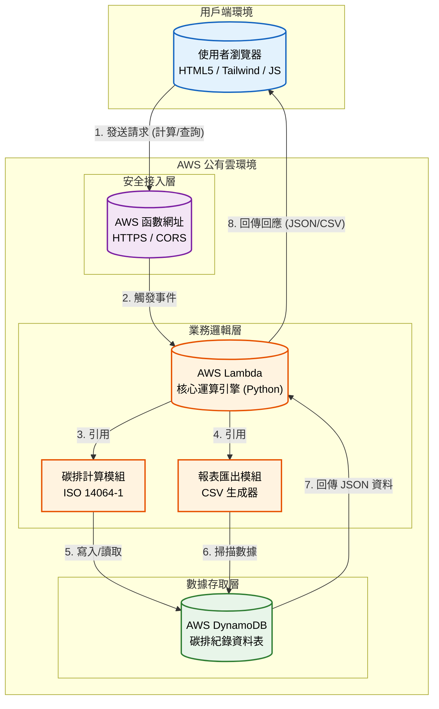

# 企業綠色融資暨智慧碳管理平台

## 1. 專案介紹

### 1.1 系統目的簡介

本系統旨在協助金融機構與企業用戶進行符合 **ISO 14064-1** 標準的碳排放盤查。透過雲端無伺服器架構，提供即時的碳排試算、歷史數據追蹤及可視化儀表板，解決傳統 Excel 盤查效率低落與數據保存不易之問題，並為後續的「綠色融資」審核提供可信的數據基礎。

---

## 2. 系統架構與範圍

### 2.1 系統架構圖

依據講義架構設計原則，本系統採用 **三層式架構** 設計，並區分為用戶端、公有雲環境與數據層。



### 2.2 系統範圍

* **展示層**: 響應式網頁介面，提供數據輸入與圖表展示。
* **業務邏輯層**: AWS Lambda 雲端運算，負責排放係數計算與邏輯處理。
* **數據存取層**: Amazon DynamoDB 資料庫，負責高效率的讀寫與儲存。

### 2.3 交付項目

1. **網頁應用程式**: `index.html` (整合 Tailwind CSS, Chart.js)。
2. **後端運算函數**: `lambda_function.py` (Python 3.x)。
3. **系統規格文件**: 本規格書。
4. **測試報告**: 包含連線測試與數據驗證截圖。

---

## 3. 業務功能需求

本節參照講義之使用案例格式描述。

| 需求編號 | 功能名稱 | 參與者 | 功能描述 | 業務邏輯/備註 |
| --- | --- | --- | --- | --- |
| **FR-01** | **使用者身分驗證** | 企業用戶 | 用戶輸入員工編號登入系統。 | 系統需驗證後端連線狀態，若連線失敗則進入離線演示模式。 |
| **FR-02** | **碳排試算引擎** | 企業用戶 | 輸入範疇一、二、三之活動數據 (油、電、水等)，計算總碳排量。 | 依據 ISO 14064-1 係數進行運算：總量 = Σ(活動數據 × 排放係數)。 |
| **FR-03** | **數據持久化存儲** | 系統 | 將計算結果自動寫入雲端資料庫。 | 需紀錄 `UUID`, `時間戳記`, `輸入數據`, `計算結果`。 |
| **FR-04** | **歷史趨勢儀表板** | 企業用戶 | 查看過往碳排紀錄之折線圖與累計數值。 | 需從資料庫讀取最近 10 筆資料，並按時間排序。 |
| **FR-05** | **報表匯出功能** | 企業用戶/稽核 | 下載盤查結果為 CSV 檔案。 | 透過 `?action=export` 參數觸發，生成 Excel 可讀格式。 |

---

## 4. 非業務功能需求

依據講義「雲端架構設計核心概念」制定。

### 4.1 安全性要求

* **傳輸加密**: 全程使用 **HTTPS** 協定進行資料傳輸。
* **存取控制**: 雲端函數網址僅允許特定的來源存取，並嚴格限制允許的標頭為 `Content-Type`。
* **資料隔離**: 不同筆紀錄擁有獨立的唯一識別碼。

### 4.2 系統效能

* **回應時間**: 碳排計算與圖表載入需在 **2 秒內** 完成 (冷啟動除外)。
* **併發處理**: 利用無伺服器特性，支援自動擴展以應對多用戶同時操作。

### 4.3 可用性與可靠性

* **服務水準**: 依賴 AWS 基礎設施，目標可用性為 99.9%。
* **資料保存**: 資料庫提供多可用區備援，確保數據不遺失。

---

## 5. 系統介面設計

### 5.1 API 規格

系統透過單一端點處理不同請求。

* **端點**: `https://<您的ID>.lambda-url.ap-northeast-1.on.aws`

#### 介面 A: 提交計算 (POST)

* **輸入**: JSON 格式

```json
{
  "diesel": 100,
  "power": 500,
  "travel": 200
}

```

* **輸出**: JSON (包含計算結果與紀錄 ID)

#### 介面 B: 獲取歷史紀錄 (GET)

* **查詢參數**: 無
* **輸出**: JSON 陣列 (最近 10 筆紀錄)

#### 介面 C: 匯出報表 (GET)

* **查詢參數**: `?action=export`
* **輸出**: `.csv` 文件下載

---

## 6. 專案安裝與執行

### 前置需求

* AWS 帳號 (具備 Lambda 與 DynamoDB 權限)。
* 現代瀏覽器 (Chrome/Edge/Safari)。

### 部署步驟

1. **AWS DynamoDB**: 建立資料表 `CarbonRecords`，主鍵設為 `record_id` (字串)。
2. **AWS Lambda**:
* 建立 Python 3.x 函數。
* 貼上 `lambda_function.py` 程式碼。
* 賦予角色讀寫資料庫的權限。
* 啟用函數網址，驗證類型設為 `NONE`，並在 CORS 設定中將允許來源設為 `*`。


3. **前端**:
* 修改 `index.html` 中的 `const lambdaUrl` 為您的函數網址。
* 直接用瀏覽器開啟 `index.html` 即可使用。


---

*本文件依據 林佩蘭 部長 系統平台架構與規格設計課程製作。*
